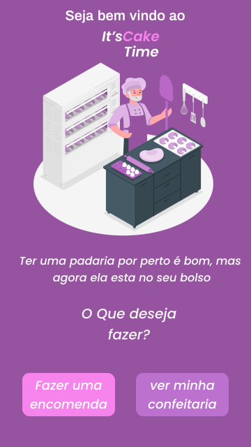
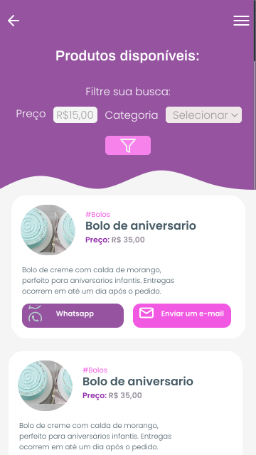
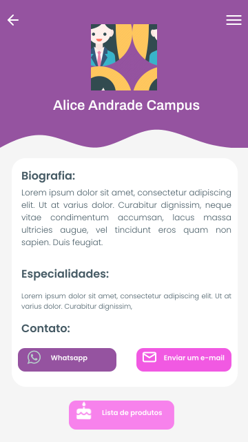
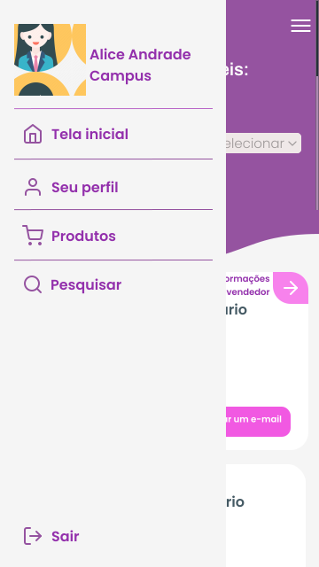
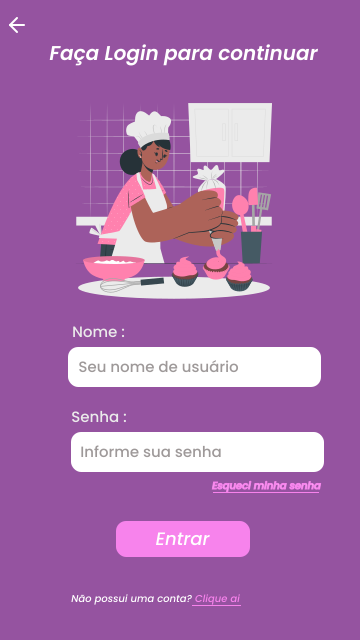

<h1 align="center">
    
</h1>

<h3 align="center">
  One click away from your favorite bakery
</h3>

  

  

  <a href="#calendar-sobre">About</a>&nbsp;&nbsp;&nbsp;|&nbsp;&nbsp;&nbsp; 
  <a href="#memo-licença">License</a>&nbsp;&nbsp;&nbsp;|&nbsp;&nbsp;&nbsp; 
  <a href="https://www.figma.com/file/pd9G6cgbUey1yrHm11V393/It-sCakeTime?node-id=0%3A1">Figma</a>

## 📆 About

This is a simple mobile app for making connections between bakers and their customers.

If you are a baker, you'll be able to create your account and show your cakes and candies to the world. If you are a costumer, you be able to search and found that perfect cake for the event you're planning.

### Deployed Application:

it's Cake Time API: https://itscaketime-server.herokuapp.com/products

IT's Cake Time APK download: 
https://exp-shell-app-assets.s3.us-west-1.amazonaws.com/android/%40edmarcos_filho/Mobile-5d8bc32c307c446dad45b42cf23e13cb-signed.apk

## 💻 How to execute the project

To run the project source code you'll need Node.Js on your machine.

[Download NodeJs here](https://nodejs.org/en/download/)

If you have Node.js installed, follow this steps in your terminal:

> git clone https://github.com/Ed-Games/ItsCakeTime.git

> cd itsCakeTime

> cd backend

> yarn dev

Let the server runing and open another terminal in ItsCakeTime folder.

> cd Mobile

> yarn start

To see the app working download Expo Client [here](https://docs.expo.dev/) and use it to read the QR Code that will appear.

## 📝 License

This project is licensed under the MIT license. See the [LICENSE](/LICENSE) file for details.

Please, if you are going to create another project with the same images and artwork, give credit to the authors:  
<a href="https://storyset.com/business">SVG illustrations by Storyset</a> 
<a href="https://www.blobmaker.app/">Blobs SVG made by Blobmaker</a>

## 🖼️ Images
<h1 align="center">
    
</h1>
<h1 align="center">
    
</h1>
<h1 align="center">
    
</h1>
<h1 align="center">
    
</h1>
<h1 align="center">
    
</h1>
<h1 align="center">
    
</h1>

---
